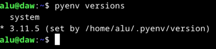

# Cositas molonas de la máquina virtual

## Python

Abrir intérprete interactivo de Python (`ipython`):

```console
$ p
```

### Pyenv

La gestión de las distintas versiones de Python se realiza a través de la herramienta [pyenv](https://github.com/pyenv/pyenv). Esto facilita la instalación de versiones antiguas o modernas del lenguaje aislando cada una del sistema operativo.



### Entornos virtuales

Activar el entorno virtual:

```console
$ cd <ruta/al/proyecto>
$ v
```

Desactivar el entorno virtual:

```console
$ cd <rutal/al/proyecto>
$ d
```

## Copiar y pegar

> Ya está habilitado el portapapeles bidireccional entre la máquina real y la máquina virtual.

Para copiar desde la terminal **basta con seleccionar texto**:


También es posible **copiar el contenido de cualquier fichero** desde línea de comandos con el siguiente comando:

```console
$ copy <fichero>
```

La copia también **funciona si usamos "pipes"** en línea de comandos:

```console
$ cat setup.sh | copy
```

## Manejo de ficheros

Listado de **todos los ficheros con detalles y tamaños en unidades "humanas"** ordenados de más reciente a menos reciente modificación:

```console
$ ll
```

Listado de **todos los ficheros (también ocultos) con detalles y tamaños en unidades "humanas"** ordenados de más reciente a menos reciente modificación:

```console
$ lla
```

Es posible **crear una carpeta y moverse a ella** (todo en uno) utilizando el siguiente comando:

```console
$ take <nueva/ruta>
```

## Visual Studio Code

**Abrir cualquier proyecto** en Visual Studio Code:

```console
$ cd <ruta/al/proyecto>
$ e
```

En Visual Studio Code están ya configurados los siguientes **componentes Python**:

- [Flake8](https://flake8.pycqa.org/en/latest/): herramienta de estilo.
- [Isort](https://pycqa.github.io/isort/): ordenación automática de "imports".
- [Black](https://github.com/psf/black): autoformateador de código Python.
- [Mypy](https://mypy-lang.org/): verificador de tipos estáticos.

## Vim

El editor [Vim](https://www.vim.org/) está ya configurado con los siguientes **plugins**:

- [Vim Airline](https://github.com/vim-airline/vim-airline): Barra de estado super vitaminada.
- [Ctrlp](https://github.com/kien/ctrlp.vim): Navegador de ficheros de acceso rápido.
- [Tema PaperColor](https://github.com/NLKNguyen/papercolor-theme): Tema de color.

Igualmente se han preparado algunos **comandos útiles**:

- `dl`: duplicar la línea actual.
- `vv`: seleccionar la línea actual.
- `Ctrl-y`: copiar la selección al portapapeles.
- `a`: copiar la selección justo debajo del cursor.

## Bases de datos

### sqlite3

Herramienta cliente en línea de comandos para manejar bases de datos de tipo sqlite.
