# UT2: Construyendo un blog

## Entornos virtuales en Python

Las aplicaciones en Python usualmente hacen uso de paquetes y módulos que no forman parte de la librería estándar. Las aplicaciones a veces necesitan una versión específica de una librería, debido a que dicha aplicación requiere que un bug particular haya sido solucionado o bien la aplicación ha sido escrita usando una versión obsoleta de la interfaz de la librería.

Esto significa que tal vez no sea posible para una instalación de Python cumplir los requerimientos de todas las aplicaciones. Si la aplicación A necesita la versión 1.0 de un módulo particular y la aplicación B necesita la versión 2.0, entonces los requerimientos entran en conflicto e instalar la versión 1.0 o 2.0 dejará una de las aplicaciones sin funcionar.

La solución a este problema es crear un entorno virtual, un directorio que contiene una instalación de Python de una versión en particular, además de unos cuantos paquetes adicionales.

Supongamos que nuestro proyecto estará contenido en la carpeta `mysite`. Una vez dentro de dicha carpeta podemos lanzar el siguiente comando para crear un entorno virtual de Python:

```console
$ python -m venv .venv --prompt mysite
```

> 💡 El nombre `.venv` es solo una convención.

Esto hará que se cree una carpeta llamada `.venv` con todos los ficheros necesarios del entorno virtual:

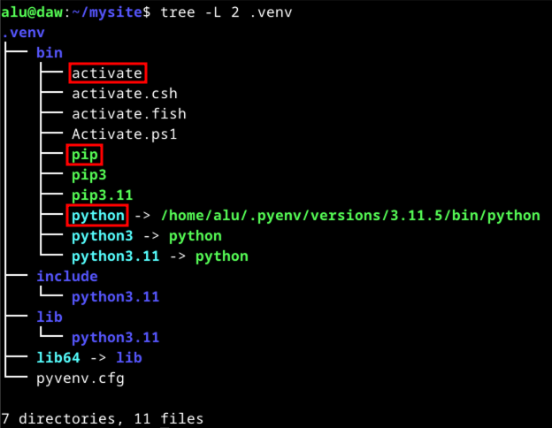

El fichero `activate`, como su propio nombre indica, nos permite activar el entorno virtual, es decir, cualquier acción realizada con Python a partir de ese momento quedará dentro del entorno virtual.

Para activar un entorno virtual haremos lo siguiente:

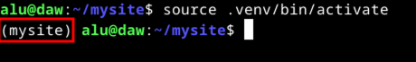

> 💡 Entre paréntesis aparece `(mysite)` indicando que el entorno virtual está activo. Viene de haber usado el parámetro `--prompt` en la creación del entorno virtual.

Los binarios `python` y `pip` también están dentro del entorno virtual haciendo referencia a su conjunto de librerías.

Para **desactivar un entorno virtual** basta con ejecutar: `deactivate`

## Django


**Django es un framework escrito en Python que permite el desarrollo rápido de aplicaciones web**.

Dentro de su [filosofía de diseño](https://docs.djangoproject.com/es/4.1/misc/design-philosophies/) destaca el patrón **Modelo-Plantilla-Vista** (o MTV por sus siglas inglesas Model-Template-View). Es un patrón muy similar al conocido MVC (Modelo-Vista-Controlador) pero con algunas diferencias:

- **Modelo**: define la estructura lógica de los datos.
- **Plantilla**: es la capa de presentación.
- **Vista**: se comunica con la bases de datos (vía modelos) y transfiere los datos a la plantilla para su visualización.

El framework en sí mismo actúa como **controlador**. Envía una petición a la vista apropiada de acuerdo con la configuración de las URLs.

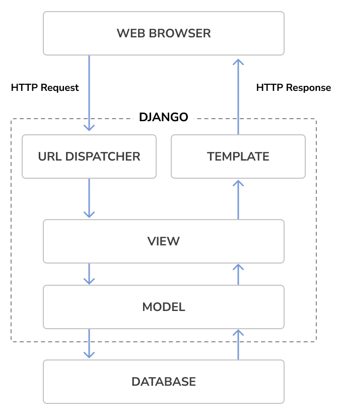

Para **instalar Django** utilizamos el gestor de paquetes siempre con **el entorno virtual activado**:

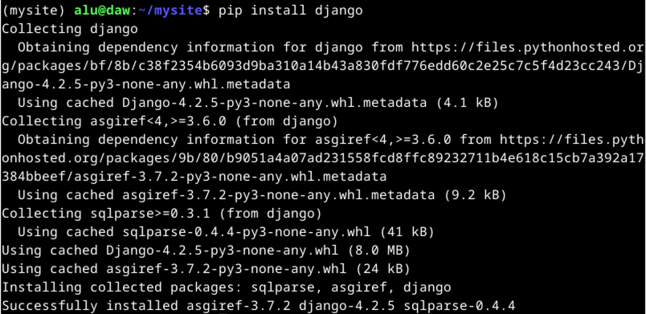

## Estructura base de un proyecto Django

Django proporciona distintas herramientas de línea de comandos (CLI - Command Line Interface) para gestionar los proyectos.

La mayoría de ellas están integradas en el comando `django-admin`. A continuación vemos cómo crear un proyecto inicial:

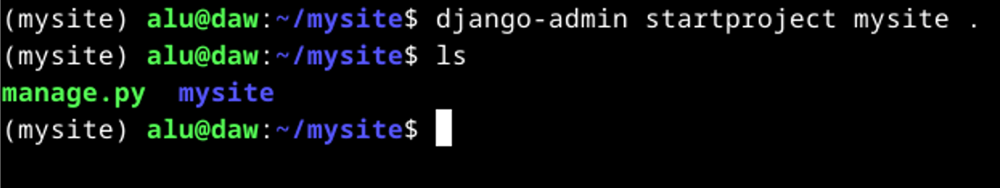

Se ha creado un fichero `manage.py` que nos permitirá gestionar el proyecto y una carpeta `mysite` que contiene las configuraciones base del proyecto.

## Migraciones

Uno de los puntos fuertes de Django es que podemos gestionar los cambios en la base de datos de manera "transparente" a través de las **migraciones**.

Estas migraciones son un conjunto de sentencias SQL que llevan a cabo las modificaciones pertinentes a la base de datos en función de cómo hayamos transformado los modelos.

La configuración por defecto de la base de datos para un nuevo proyecto Django es utilizar [SQLite](https://www.sqlite.org/index.html). Sin embargo es posible "enchufar" cualquier sistema gestor de bases de datos: [PostgreSQL](https://www.postgresql.org/), [MySQL](https://www.mysql.com/) u [Oracle](https://es.wikipedia.org/wiki/Oracle_Database).

La documentación de Django cubre [los aspectos relacionados con la configuración de las bases de datos](https://docs.djangoproject.com/es/4.1/topics/install/#get-your-database-running).

Lanzamos las migraciones iniciales con el siguiente comando:

```console
$ python manage.py migrate
```

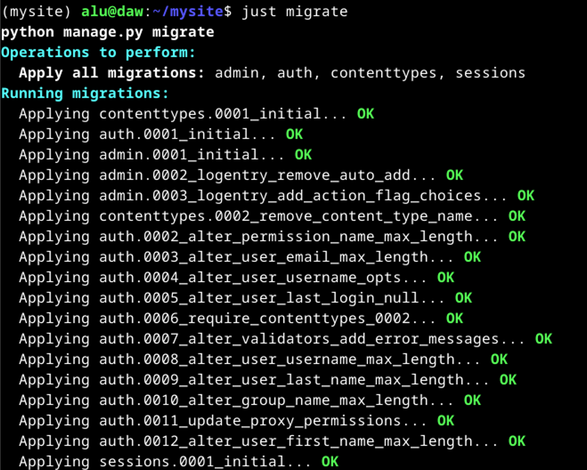

Django sabe qué migraciones debe lanzar porque busca los modelos creados en aquellas aplicaciones instaladas definidas en la variable `INSTALLED_APPS` de `mysite/settings.py`.

## Justfile

Poco a poco iremos viendo que se manejarán distintos comandos para la gestión de nuestro proyecto. Suele ser útil agrupar todos estos comandos en algún "libro de recetas" que nos facilite su búsqueda y ejecución.

Un proyecto interesante para este cometido es [just](https://github.com/casey/just) que se define como _"a handy way to save and run project-specific commands"_.

Crearemos un fichero `justfile` en la raíz de nuestro proyecto con el siguiente contenido:

```makefile
runserver:
    python manage.py runserver

migrate:
    python manage.py migrate

startapp app:
    python manage.py startapp {{app}}
```

Así, podremos - por ejemplo - lanzar las migraciones con:

```console
$ just migrate
```

## Servidor de desarrollo

Django viene con un servidor web "ligero" para poder correr rápidamente nuestro proyecto sin necesidad de gastar tiempo en configurar un servidor de producción.

Este servidor está pendiente de los cambios en el código y recarga el proyecto en caso de haber modificado algún archivo, aunque en algunas ocasiones no es así cuando por ejemplo añadimos nuevos ficheros. En esos casos hay que parar y lanzar de nuevo el servidor de desarrollo.

Para levantar el servidor de desarrollo usamos el siguiente comando:

```console
$ python manage.py runserver
```

O usando nuestro `justfile` podemos ejecutar:

```console
$ just runserver
```

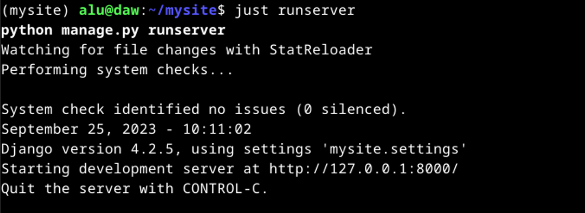

Si ahora abrimos el navegador en la URL especificada http://127.0.0.1:8000 podremos observar que el proyecto inicial se ha levantado satisfactoriamente:

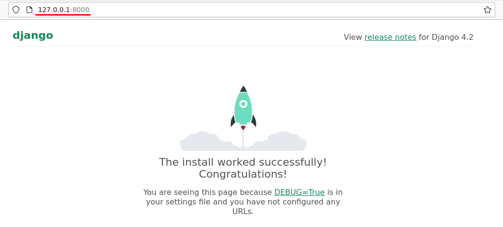

> 💡 Desde la terminal podremos abrir la URL pulsando la tecla <kbd>Ctrl</kbd> y haciendo click en el enlace.

El servidor de desarrollo no está pensando para entornos de producción. Para estos casos necesitaremos una infraestructura diferente:

- Servidor web:

  - [Nginx](https://www.nginx.com/)
  - [Apache](https://httpd.apache.org/)

- Servidor de aplicación:

  - Síncrono:
    - [Gunicorn](https://gunicorn.org/)
    - [uWSGI](https://uwsgi-docs.readthedocs.io/en/latest/)
  - Asíncrono:
    - [Uvicorn](https://www.uvicorn.org/)
    - [Daphne](https://github.com/django/daphne)

Se puede ampliar información sobre [despliegue de aplicaciones Django](https://docs.djangoproject.com/es/4.1/howto/deployment/) en su documentación oficial.

## Configuraciones

Las configuraciones del proyecto se encuentran en el fichero `mysite/settings.py`. En él podremos encontrar una gran cantidad de parámetros que definen el comportamiento del sitio web.

Inicialmente los parámetros que se incluyen son los siguientes:

- `BASE_DIR`
- `SECRET_KEY`
- `DEBUG`
- `ALLOWED_HOSTS`
- `INSTALLED_APPS`
- `MIDDLEWARE`
- `ROOT_URLCONF`
- `TEMPLATES`
- `WSGI_APPLICATION`
- `DATABASES`
- `AUTH_PASSWORD_VALIDATORS`
- `LANGUAGE_CODE`
- `TIME_ZONE`
- `USE_I18N`
- `USE_TZ`
- `STATIC_URL`
- `DEFAULT_AUTO_FIELD`

## Proyectos y aplicaciones

Es importante diferenciar, en este contexto, los dos siguientes conceptos:

- **Proyecto**: instalación Django con ciertas configuraciones.
- **Aplicación**: grupo de modelos, vistas, plantillas y URLs.

El proyecto vendría a ser el **sitio web** mientras que las aplicaciones serían las distintas **secciones** de la web, _siempre y cuando se considere que una sección tiene la entidad suficiente para converirse en aplicación_.

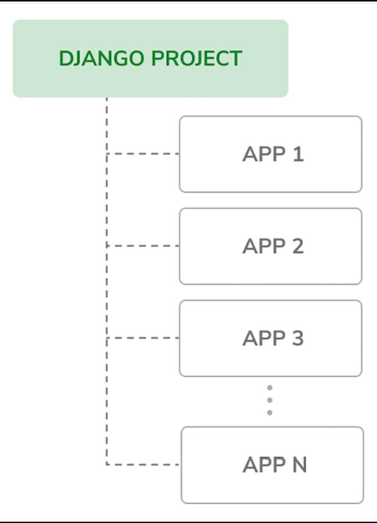

Vamos a crear la primera aplicación de nuestro sitio web:

```console
$ python manage.py startapp blog
```

Si usamos nuestro `justfile` podríamos ejecutar:

```console
$ just startapp blog
```

Con ello se habrá creado una carpeta `blog` dentro de nuestro proyecto con un contenido similar al siguiente:

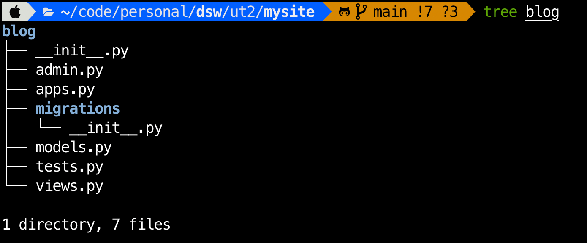

## Modelos para el blog

Un modelo de Django se representa por una clase que hereda de `django.db.models.Model`. Cada modelo se mapea a una única tabla en la base de datos, donde cada atributo de la clase representa un campo de la base de datos.

Añadimos el siguiente código al fichero `blog/models.py`:

```python
from django.db import models

class Post(models.Model):
    title = models.CharField(max_length=250)
    slug = models.SlugField(max_length=250)
    body = models.TextField()

    def __str__(self):
        return self.title
```

La correspondencia del modelo con la base de datos es la siguiente:

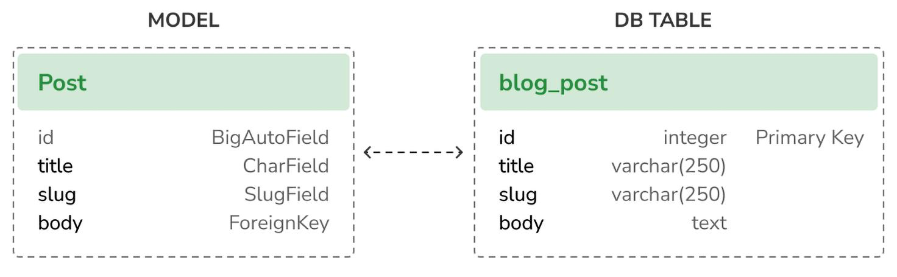

Ahora vamos a añadir ciertos campos de tipo _"datetime"_:

```python
from django.db import models
from django.utils import timezone

class Post(models.Model):
    title = models.CharField(max_length=250)
    slug = models.SlugField(max_length=250)
    body = models.TextField()
    publish = models.DateTimeField(default=timezone.now)
    created = models.DateTimeField(auto_now_add=True)
    updated = models.DateTimeField(auto_now=True)

    def __str__(self):
        return self.title
```

En este tipo de campos `DateTimeField` hay dos parámetros relevantes:

- `auto_now_add` que si toma el valor `True` la fecha se guardará automáticamente cuando se cree el objeto de tipo `Post`.
- `auto_now` que si toma el valor `True` la fecha se guardará automáticamente cuando se guarde el objeto de tipo `Post`.

Habitualmente
