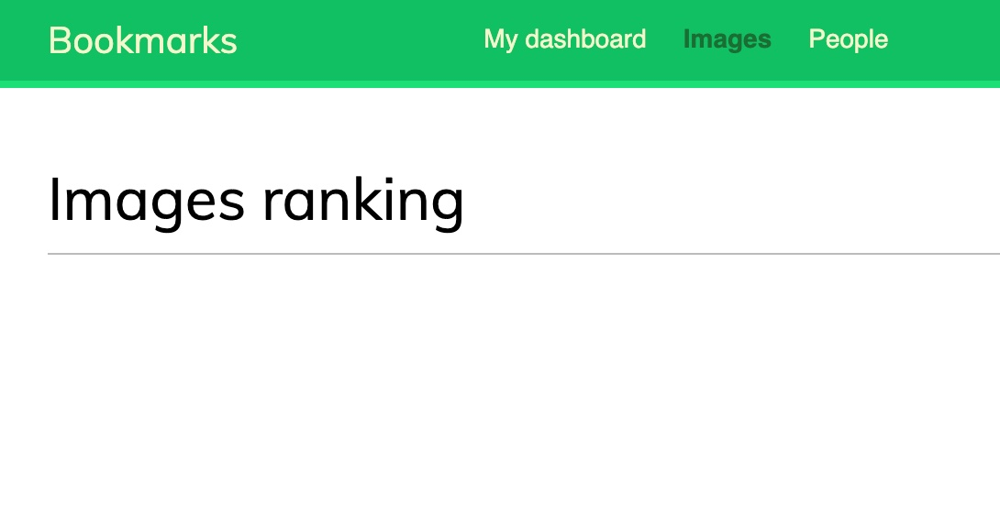

# UT3: Montando una web para compartir favoritos

➡️ **CAPÍTULO 7: GESTIONANDO ACCIONES DE USUARIO**

## Errata

En la página 297 hay una errata en el código Javascript. Lo correcto sería:

```javascript

  const url = '';
  // ...
```

## Optimizando consultas

Uso de las funciones para distintos tipos de claves:

| `select_related()`         | `prefetch_related()`                            |
| -------------------------- | ----------------------------------------------- |
| One-to-many (`ForeignKey`) | `ManyToManyField`                               |
| `OneToOneField`            | Many-to-one (`related_name` sobre `ForeignKey`) |

## Redis

No es necesario instalar [Redis sobre Docker](https://hub.docker.com/_/redis) puesto que la máquina virtual ya dispone de este servicio funcionando.

Aprovechamos [prettyconf](https://prettyconf.readthedocs.io/en/latest/) para parametrizar los ajustes de Redis en el fichero `settings.py`:

```python
REDIS_HOST = config('REDIS_HOST', default='localhost')
REDIS_PORT = config('REDIS_PORT', default=6379, cast=int)
REDIS_DB = config('REDIS_DB', default=0, cast=int)
```

## Ranking de imágenes

### Nombre de clave

Yo usaría la clave `image:ranking` en vez de `image_ranking` para llevar el ranking de imágenes en Redis (por las buenas prácticas de espacios de nombres).

Esto se aplica en la página 329 del libro.

### Ranking vacío

Es posible que (al principio) el ranking de imágenes salga vacío:



→ Esto se debe a que la actualización de ranking (Redis) se produce al visualizar cada imagen. Basta con entrar a un par de imágenes y ya podremos comprobar que funciona correctamente.
