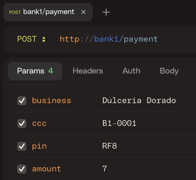

# UT3-TE1: Banco online

### TAREA EVALUABLE


[Modelo entidad-relación](#modelo-entidad-relación)  
[Tipos de objetos](#tipos-de-objetos)  
[Transferencias](#transferencias)  
[Pagos](#pagos)  
[Secciones de la web](#secciones-de-la-web)  
[Entrega de la tarea](#entrega-de-la-tarea)

## Nombre del proyecto

✨ El nombre del proyecto Django será `bank`:

```console
django-admin startproject bank .
```

## Modelo entidad-relación


## Tipos de objetos

### Tipos de transacciones

Habrá (al menos) 4 tipos de transacciones:

1. Compras
2. Transferencias entrantes
3. Transferencias salientes
4. Comisiones

### Estado de los objetos

Habrá (al menos) 3 tipos de estados:

1. Activo.
2. Bloqueado.
3. De baja.

### Código de cuenta cliente

Nuestro CCC (Código de Cuenta Cliente) seguirá la siguiente expresión regular:

`B[1-7]-\d\d\d\d`

`B[1-7]` indicará el banco al que hacemos referencia:

- `B1`: Banco del grupo 1 → http://bank1
- `B2`: Banco del grupo 2 → http://bank2
- `B3`: Banco del grupo 3 → http://bank3
- `B4`: Banco del grupo 4 → http://bank4
- `B5`: Banco del grupo 5 → http://bank5
- `B6`: Banco del grupo 6 → http://bank6
- `B7`: Banco del grupo 7 → http://bank7

Las cuentas, dentro del mismo banco, se irán asignando de manera correlativa. Por ejemplo, para el banco `B1`:

- `B1-0001`
- `B1-0002`
- `B1-0003`

### Código de tarjeta

Los **códigos de las tarjetas** tendrán la siguiente estructura y se irán asignando de manera correlativa:

- `CC-0001`
- `CC-0002`
- `CC-0003`

Los **códigos PIN** de las tarjetas serán secuencias de 3 caracteres alfanuméricos (dígitos y/o letras en mayúsculas). Ejemplos:

- `X4B`
- `3YA`
- `99T`

## Transferencias

Podemos tener **transferencias entrantes** o **transferencias salientes**.

### Protocolo de transferencias

Supongamos que el banco 1 quiere enviar una transferencia al banco 2. Para ello, el banco 1 tendría que hacer una petición POST al banco 2 a través de la siguiente URL:

`http://bank2/transfer/incoming`

Con los campos:

| Campo     | Descripción                                      |
| --------- | ------------------------------------------------ |
| `sender`  | Nombre del ordenante                             |
| `cac`     | Código de cuenta cliente (_client account code_) |
| `concept` | Concepto                                         |
| `amount`  | Importe                                          |

Códigos de respuesta:

- Si todo ha ido bien se debe devolver un [200 OK](https://docs.djangoproject.com/en/4.2/ref/request-response/#httpresponse-objects).
- Si ha habido algún error se debe devolver un [400 Bad Request](https://docs.djangoproject.com/en/4.2/ref/request-response/#django.http.HttpResponseBadRequest) indicando en el mensaje de error la descripción de lo sucedido.

## Pagos

Sólo es posible **realizar pagos usando tarjeta**.

### Protocolo de pagos

Supongamos que un cliente del banco 1 compra una pachanga en el comercio "Dulces Dorado" pagando con tarjeta.

Para que "Dulces Dorado" pueda hacer el cobro tendría que hacer una petición POST a la siguiente URL:

`http://bank1/payment`

Con los campos:

| Campo      | Descripción                                        |
| ---------- | -------------------------------------------------- |
| `business` | Comercio                                           |
| `ccc`      | Código de **tarjeta cliente** (_client card code_) |
| `pin`      | Código de seguridad de la tarjeta                  |
| `amount`   | Importe                                            |

Códigos de respuesta:

- Si todo ha ido bien se debe devolver un [200 OK](https://docs.djangoproject.com/en/4.2/ref/request-response/#httpresponse-objects).
- Si el código de seguridad de la tarjeta no es el correcto se debe devolver un [403 Forbidden](https://docs.djangoproject.com/en/4.2/ref/request-response/#django.http.HttpResponseForbidden).
- Si ha habido algún otro error se debe devolver un [400 Bad Request](https://docs.djangoproject.com/en/4.2/ref/request-response/#django.http.HttpResponseBadRequest) indicando en el mensaje de error la descripción de lo sucedido.

### Simulando pagos

Para simular un pago debemos realizar **una petición POST** al banco.

#### Línea de comandos

Podemos simular un pago utilizando la herramienta de línea de comandos [curl](https://curl.se/).

Ejemplo de uso:

```bash
curl -X POST -d '{"business": "Dulcería Dorado", "ccc": "B1-0001", "pin": "RF8", "amount": "7"}' http://bank1/payment
```

#### Navegador

Podemos simular un pago utilizando la herramienta web [httpie.io](https://httpie.io/app)

Ejemplo de uso:



## Secciones de la web

Habrá que implementar (al menos) las siguientes secciones de la web:

- Registro.
- Login.
- Edición del perfil.
- Solicitud/Gestión de cuentas cliente.
- Solicitud/Gestión de tarjetas.
- Solicitud/Gestión de transferencias.
- Visualización de movimientos (transacciones).
- Procesamiento de pagos.

## Entrega de la tarea

Se habilitará una entrega en el **Campus Virtual** donde se tendrá que subir únicamente **la URL al proyecto incluyendo el commit específico**.

Para ello basta con acceder en GitHub a la carpeta donde se encuentre el proyecto:

→ `https://github.com/alu/bank`

, y pulsar la tecla <kbd>y</kbd> para que la URL se nos convierta en un formato tipo:

→ `https://github.com/alu/bank/tree/ffaabb62206fa0c0f350dfe0a4ba370ed00b9218`

> 💡 La parte de la url que consta de 40 caracteres es el **hash del commit** y lo identifica de manera unívoca: `ffaabb62206fa0c0f350dfe0a4ba370ed00b9218`

Por lo tanto, **lo único que hay que subir es la URL que incluye dicho hash**.

> ⚠️ El proyecto deberá estar funcional en las URLs de cada banco en la red interna del departamento: http://bank1, http://bank2, ...
