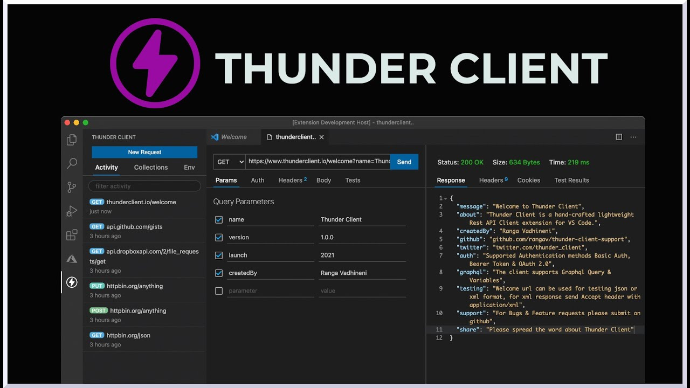

# UT3-TE1: Banco online

### TAREA EVALUABLE


[Puesta en marcha](#puesta-en-marcha)  
[Modelo entidad-relación](#modelo-entidad-relación)  
[Tipos de objetos](#tipos-de-objetos)  
[Transacciones](#transacciones)  
[Comisiones](#comisiones)  
[Secciones de la web](#secciones-de-la-web)  
[Entrega de la tarea](#entrega-de-la-tarea)

## Puesta en marcha

### 🐱 Repositorio

Requisitos del repositorio GitHub del proyecto:

- El nombre será el nombre del banco (todo en minúsculas y usando guión medio si hay que separar algo). Ejemplos:
  - `yladia-bank`
  - `bankus`
  - `bank-and-roll`
  - `bankarta`
- El repositorio deberá ser **privado**.

### 🐍 Proyecto Django

El nombre del proyecto Django será `bank`:

```console
django-admin startproject bank .
```

## Modelo entidad-relación

Se deberá tener (al menos) los siguientes modelos en la base de datos:


- Utilizar una base de datos `sqlite3`.
- Tanto `password` como `pin` habrá que almacenarlos como un hash en la base de datos utilizando para ello el algoritmo [PBKDF2](https://docs.djangoproject.com/en/4.2/topics/auth/passwords/).

## Tipos de objetos

### Bancos

El identificador de cada banco corresponderá con el identificador del grupo (empezando en 1).

Podemos obtener la [información de los bancos](./files/banks.json) a través del siguiente código Python:

```python
>>> import requests

>>> url = 'https://raw.githubusercontent.com/sdelquin/dsw/main/ut3/te1/notes/files/banks.json'
>>> response = requests.get(url)
>>> banks = response.json()
```

#### Levantar servidor para aceptar peticiones "externas"

Para que nuestro banco pueda aceptar peticiones externas (básicamente [transferencias entrantes](#simulando-transferencias)) debemos realizar una serie de pasos:

1. Establecer los valores adecuados para la variable `ALLOWED_HOSTS`. Dentro de `settings.py` añadir lo siguiente:

```python
ALLOWED_HOSTS = config('ALLOWED_HOSTS', default=[], cast=config.list)
```

2. Añadir los posibles hosts en `.env`. Si estamos hablando del banco `dsw.pc10.aula109` tendríamos lo siguiente:

```console
ALLOWED_HOSTS=dsw.pc10.aula109,127.0.0.1,localhost
```

3. Levantar el servidor de desarrollo escuchando en todas las interfaces:

```console
python manage.py runserver 0.0.0.0
```

> 💡 Esto hará que podamos acceder al banco a través de: `http://dsw.pc10.aula109:8000`

### Tipos de transacciones

Habrá (al menos) 3 tipos de transacciones:

1. Compras
2. Transferencias entrantes
3. Transferencias salientes

### Estado de los objetos

Habrá (al menos) 3 tipos de estados:

1. Activo.
2. Bloqueado.
3. De baja.

### Código de cuenta cliente

El código de cuenta cliente seguirá la siguiente expresión regular:

`A\d-\d\d\d\d`

Las cuentas, dentro del mismo banco, se irán asignando de manera correlativa. Por ejemplo, **para el banco 1**:

- `A1-0001`
- `A1-0002`
- `A1-0003`

> 💡 "A" viene de "Account"

### Código de tarjeta

El código de tarjeta cliente seguirá la siguiente expresión regular:

`C\d-\d\d\d\d`

Las tarjetas, dentro del mismo, se irán asignando de manera correlativa. Por ejemplo, **para el banco 1**:

- `C1-0001`
- `C1-0002`
- `C1-0003`

> 💡 "C" hace referencia a "Card"

Los **códigos PIN** de las tarjetas serán secuencias de 3 caracteres alfanuméricos (dígitos y/o letras en mayúsculas) generados **aleatoriamente**. Ejemplos:

- `X4B`
- `3YA`
- `99T`

> ⚠️ Recuerda almacenar estos códigos de seguridad "hasheados" en la base de datos.

## Transacciones

### Pagos

Sólo es posible **realizar pagos usando tarjeta**.

#### Protocolo de pagos

Supongamos que un cliente del banco 1 compra una pachanga en el comercio "Dulces Dorado" pagando con tarjeta.

Para que "Dulces Dorado" pueda hacer el cobro tendría que hacer una petición POST a la siguiente URL:

`http://<url-bank1>/payment/`

Con los campos:

| Campo      | Descripción                                        |
| ---------- | -------------------------------------------------- |
| `business` | Comercio                                           |
| `ccc`      | Código de **tarjeta cliente** (_client card code_) |
| `pin`      | Código de seguridad de la tarjeta                  |
| `amount`   | Importe                                            |

Códigos de respuesta:

- Si todo ha ido bien se debe devolver un [200 OK](https://docs.djangoproject.com/en/4.2/ref/request-response/#httpresponse-objects).
- Si el código de seguridad de la tarjeta no es el correcto se debe devolver un [403 Forbidden](https://docs.djangoproject.com/en/4.2/ref/request-response/#django.http.HttpResponseForbidden).
- Si ha habido algún otro error se debe devolver un [400 Bad Request](https://docs.djangoproject.com/en/4.2/ref/request-response/#django.http.HttpResponseBadRequest) indicando en el mensaje de error la descripción de lo sucedido.

#### Simulando pagos

Para simular un pago debemos realizar **una petición POST** al banco.

Una herramienta poderosa para realizar peticiones HTTP desde línea de comandos es [curl](https://curl.se/).

Ejemplo de uso:

```bash
curl -X POST -d '{"business": "Dulcería Dorado", "ccc": "C1-0001", "pin": "R8K", "amount": "7"}' http://<url-bank1>/payment/
```

Esta petición envía un _payload_ en formato `json` que deberemos procesar en la vista correspondiente. Nuestra vista de Django deberá tener la siguiente forma:

```python
import json

from django.views.decorators.csrf import csrf_exempt
...
...
@csrf_exempt
def transfer(request):
    data = json.loads(request.body)
    # En data tendremos un diccionario con los datos enviados
    ...
    return HttpResponse()
```

> 💡 `@csrf_exempt` es un decorador que deja exenta a la vista de comprobar el CSRF token. **No es una buena práctica en general** pero nos resuelve el problema puntual de la petición HTTP externa.

#### Peticiones HTTP en VSCode

Una extensión interesante que nos permite integrar _HTTP requests_ en VSCode es [Thunder Client](https://marketplace.visualstudio.com/items?itemName=rangav.vscode-thunder-client).

Su uso es muy sencillo ya que nos aparece una ventana en la que podemos especificar URL y parámetros de la petición HTTP.



### Transferencias

Podemos tener **transferencias entrantes** o **transferencias salientes**.

#### Protocolo de transferencias

Supongamos que el banco 1 quiere enviar una transferencia al banco 2. Para ello, el banco 1 tendría que hacer una petición POST al banco 2 a través de la siguiente URL:

`http://<url-bank2>/transfer/incoming/`

Con los campos:

| Campo     | Descripción                                      |
| --------- | ------------------------------------------------ |
| `sender`  | Nombre del ordenante                             |
| `cac`     | Código de cuenta cliente (_client account code_) |
| `concept` | Concepto                                         |
| `amount`  | Importe                                          |

Códigos de respuesta:

- Si todo ha ido bien se debe devolver un [200 OK](https://docs.djangoproject.com/en/4.2/ref/request-response/#httpresponse-objects).
- Si ha habido algún error se debe devolver un [400 Bad Request](https://docs.djangoproject.com/en/4.2/ref/request-response/#django.http.HttpResponseBadRequest) indicando en el mensaje de error la descripción de lo sucedido.

#### Simulando transferencias entrantes

Para simular una transferencia entrante podemos usar el mismo procedimiento que [hemos visto anteriormente con los pagos](#simulando-pagos) a través de **una petición POST** al banco correspondiente.

#### Probando transferencias salientes

El **Banco 0 (Test Bank)** está disponible para probar una transferencia saliente. Simplemente debemos usar un CAC de dicho banco, que básicamente es cualquiera que empiece por su código: `A0-0001`, `A0-0921`, `A0-1773`, etc.

#### Nómina

Dado que **debe haber ingresos** en la cuenta para que sea sostenible, podemos simular el ingreso de la nómina utilizando una transferencia.

Para ello realizamos una petición POST de tipo transferencia del mismo modo que hicimos para [simular pagos](#simulando-pagos).

## Comisiones

Habrá que aplicar (al menos) las siguientes comisiones:

|                  | $[0€-50€)$ | $[50€-500€)$ | $≥500€$ |
| ---------------- | ---------- | ------------ | ------- |
| Transf. saliente | 2%         | 4%           | 6%      |
| Transf. entrante | 1%         | 2%           | 3%      |
| Pagos            | 3%         | 5%           | 7%      |

> 💡 Las comisiones deben de aparecer claramente en el listado de transacciones para que el cliente sea informado.

## Funcionalidades

Habrá que implementar (al menos) las siguientes funcionalidades en el proyecto:

- Registro de usuario
- Login
- Edición del perfil de usuario
- Alta/Edición/Baja de cuenta
- Alta/Edición/Baja de tarjeta
- Envío de transferencias
- Recepción de transferencias
- Recepción de pagos
- Aplicación de comisiones
- Visualización de transacciones

## Entrega de la tarea

### Recetas

Incluir un fichero [justfile](../../ut0/files/justfile) con (al menos) las siguientes recetas:

- `dockup`
- `dockdown`
- `clean`
- `zip`

### Docker

1. Incluir los requerimientos del proyecto en `requirements.txt`.
2. Incluir los ficheros `Dockerfile` y `docker-compose.yaml` según [las indicaciones correspondientes](../../ut0/docker.md).

### Instrucciones de subida

1. Comprimir el proyecto con: `just zip`
2. Se habilitará una entrega en el **Campus Virtual** donde se tendrá que subir el proyecto comprimido.
3. Es suficiente con que lo suba una persona del grupo.
