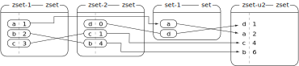

# UT4: Desarrollando un comercio electrónico

➡️ **CAPÍTULO 10: EXTENDIENDO LA TIENDA**

## Errata

Al final de la página 465 del libro, donde dice:

> Edit the `orders/order/detail.pdf` template...

Debe decir:

> Edit the `orders/order/pdf.html` template...

## Redis

La operación `ZUNIONSTORE` de los [sorted sets](https://redis.com/ebook/part-2-core-concepts/chapter-3-commands-in-redis/3-5-sorted-sets/) de Redis se puede entender mejor con un diagrama.

Supongamos la siguiente instrucción:

```python
r.zunionstore('zset-u2', ['zset-1', 'zset-2', 'set-1'])
```

El funcionamiento sería el siguiente:


