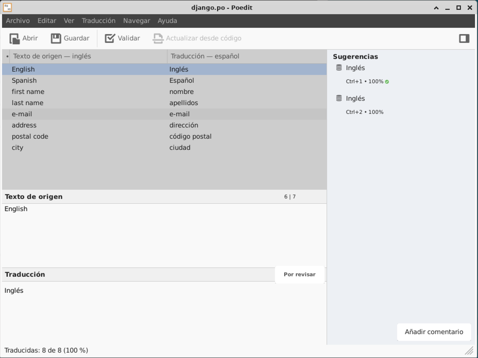

# UT4: Desarrollando un comercio electrónico

➡️ **CAPÍTULO 11: AÑADIENDO INTERNACIONALIZACIÓN A LA TIENDA**

## i18n vs l10n

Aprovechando la [documentación de Django](https://docs.djangoproject.com/en/5.0/topics/i18n/#definitions) podemos indicar las siguientes aclaraciones:

| Tarea                | Atajo  | Función                                          | Responsable        |
| -------------------- | ------ | ------------------------------------------------ | ------------------ |
| Internacionalización | `i18n` | Preparar el software para `l10n`                 | Desarrolladores/as |
| Localización         | `l10n` | Escribir las traducciones y los formatos locales | Traductores/as     |

## Errata

En la página 478 del libro debería decir que el valor por defecto de `USE_L10N` es `True`, de acuerdo con la [documentación oficial de Django](https://docs.djangoproject.com/en/4.2/ref/settings/#std-setting-USE_L10N)

## Poedit

Para utilizar [poedit](https://poedit.net/) en nuestro proyecto Django, basta con abrir desde la línea de comandos el fichero `.po` que nos interese:

```console
poedit locale/es/LC_MESSAGES/django.po
```



## Template tags

En el libro se utilizan continuamente las _template tags_ `` y ``.

En la documentación de Django encontramos estas etiquetas pero con su nombre largo:

- [Translate](https://docs.djangoproject.com/en/4.2/topics/i18n/translation/#translate-template-tag)
- [Block translate](https://docs.djangoproject.com/en/4.2/topics/i18n/translation/#blocktranslate-template-tag)

## Mejora en cambio de idioma

Página 499 del libro. Se sugiere modificar esta línea del fichero `shop/base.html`:

```
{{ language.name_local }}
```

Por:

```
{{ language.name_local|title }}
```
