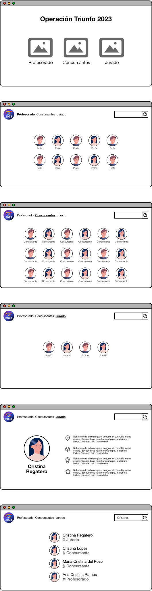

# UT4-TNE1: Operación Triunfo

### TAREA NO EVALUABLE

[Objetivo](#objetivo)  
[Nombre del proyecto](#nombre-del-proyecto)  
[Esquema de la base de datos](#esquema-de-la-base-de-datos)  
[Mockups del proyecto](#mockups-del-proyecto)  
[Aclaraciones](#aclaraciones)

## Objetivo

El objetivo de esta tarea es crear una aplicación web para consultar información relacionada con el programa de televisión [Operación Triunfo](<https://es.wikipedia.org/wiki/Operaci%C3%B3n_Triunfo_(Espa%C3%B1a)>) en su **edición 2023**.

## Nombre del proyecto

El proyecto se debe llamar `ot`.

## Esquema de la base de datos

Notas:

- La información del **profesorado** se puede extraer [desde aquí](https://www.mundodeportivo.com/elotromundo/television/20231120/1002120877/ot-2023-renueva-profesorado-listado-oficial-todos-docentes-dct.html#galeria-foto-1).
- La información de los **concursantes** se puede extraer [desde aquí](https://los40.com/2023/11/21/asi-son-los-16-concursantes-oficiales-de-ot-2023-hobbies-edades-estilos-y-datos-curiosos/).
- La información del **jurado** se puede extraer [desde aquí](https://www.marca.com/tiramillas/television/2023/11/20/655b9b3722601d5a668b457f.html).

## Mockups del proyecto

## Aclaraciones

- Intenta que la búsqueda pueda abarcar varios campos (no sólo nombre de la persona) incluyendo estilo musical.
