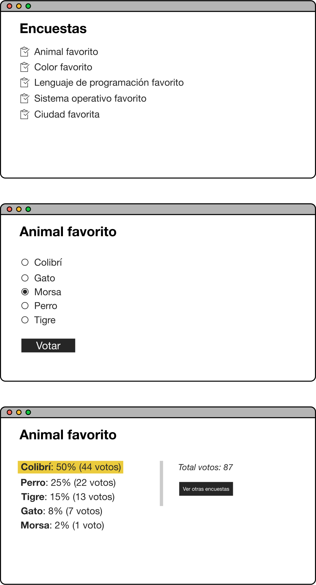

# UT4-TNE2: Encuestas

### TAREA NO EVALUABLE

[Objetivo](#objetivo)  
[Nombre del proyecto](#nombre-del-proyecto)  
[Esquema de la base de datos](#esquema-de-la-base-de-datos)  
[Mockups del proyecto](#mockups-del-proyecto)

## Objetivo

El objetivo de esta tarea es crear una aplicación web para **desplegar encuestas anónimas**.

## Nombre del proyecto

El proyecto se debe llamar `polls`.

## Esquema de la base de datos

Notas:

- Es necesario añadir un campo `choices` de tipo [ManyToManyField](https://docs.djangoproject.com/en/4.2/topics/db/examples/many_to_many/) en la tabla `Poll`.

## Mockups del proyecto

