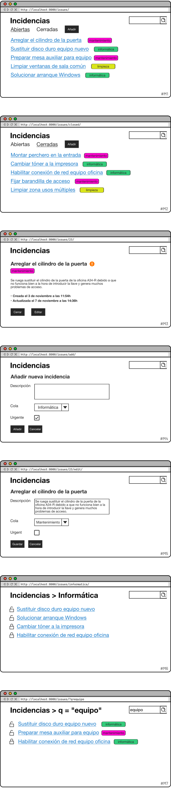

# UT4-TNE3: Incidencias

### TAREA NO EVALUABLE

[Objetivo](#objetivo)  
[Nombre del proyecto](#nombre-del-proyecto)  
[Esquema de la base de datos](#esquema-de-la-base-de-datos)  
[Aplicaciones](#aplicaciones)  
[Comportamiento](#comportamiento)  
[Mockups del proyecto](#mockups-del-proyecto)  
[Interfaz administrativa](#interfaz-administrativa)

## Objetivo

El objetivo de esta tarea es crear una aplicación web para **gestionar incidencias** en cualquier organización.

## Nombre del proyecto

El proyecto se debe llamar `solventia`.

## Esquema de la base de datos

### Claves ajenas

| Tabla   | Clave ajena     |
| ------- | --------------- |
| `Issue` | `queue → Queue` |

## Aplicaciones

Habrá 2 aplicaciones:

1. `issues` (con su modelo `Issue`)
2. `queues` (con su modelo `Queue`)

## Comportamiento

- En todas las pantallas que muestren listados de incidencias, estas se deberán ordenar de manera descendente por su fecha de creación.
- En cualquier pantalla de la aplicación si pulsamos sobre la etiqueta de una cola nos llevará a `#M6`.
- Al pulsar sobre el nombre de una incidencia nos llevará a `#M3`.
- En `#M3` el icono con exclamación saldrá si la incidencia es urgente.
- Al crear una incidencia en `#M4` se deberá enviar un correo al responsable de la cola notificando la incidencia.

## Mockups del proyecto

## Interfaz administrativa

- Posibilidad de abrir y cerrar incidencias a través de _custom actions_ para el modelo `Issue`.
