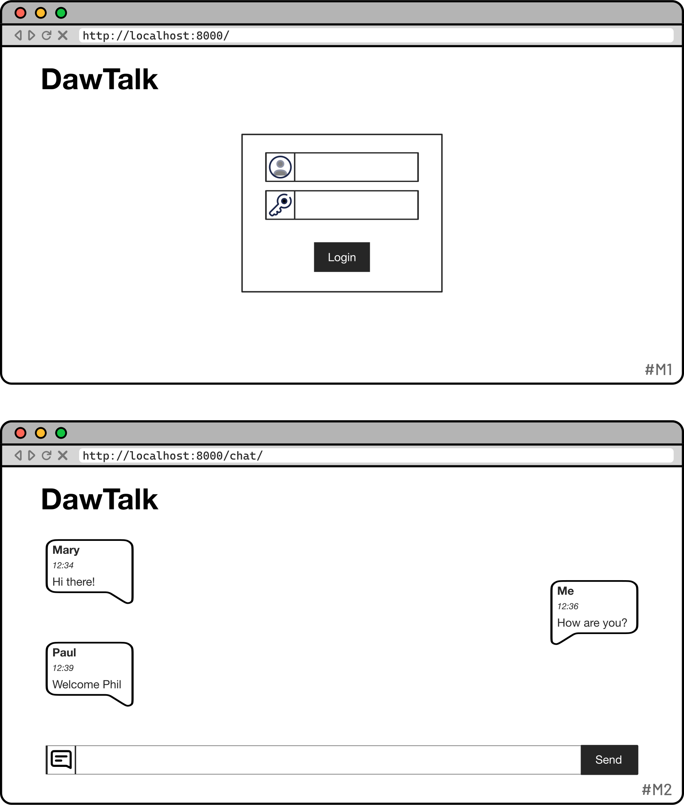

# UT5-TNE2: Chat de clase

### TAREA NO EVALUABLE


[Objetivo](#objetivo)  
[Estructura del proyecto](#estructura-del-proyecto)  
[Esquema de la base de datos](#esquema-de-la-base-de-datos)  
[Aclaraciones](#aclaraciones)  
[Posibles mejoras](#posibles-mejoras)

## Objetivo

El objetivo de esta tarea es **montar un chat** para la clase con [Django Channels](https://channels.readthedocs.io/en/latest/).

## Estructura del proyecto

```
dawtalk/
    dawtalk/
        ...
        settings.py
    chat/
        ...
```

## Esquema de la base de datos

No necesitaremos ningún modelo específico en la base de datos ya que no vamos a persistir los mensajes enviados.

## Mockups del proyecto



## Aclaraciones

- Se recomienda hacer esta tarea por parejas para poder probar cómodamente el funcionamiento del chat.
- No será necesario realizar un registro de usuario. Daremos de alta a los usuarios a través de la interfaz administrativa.
- Puedes aprovechar la función [bulk_create()](https://docs.djangoproject.com/en/5.0/ref/models/querysets/#bulk-create) que proporciona Django para inserción de filas por lotes, con la mejora de rendimiento que eso conlleva.

## Posibles mejoras

- Añadir varias salas de chat.
- Permitir registro de usuarios.
